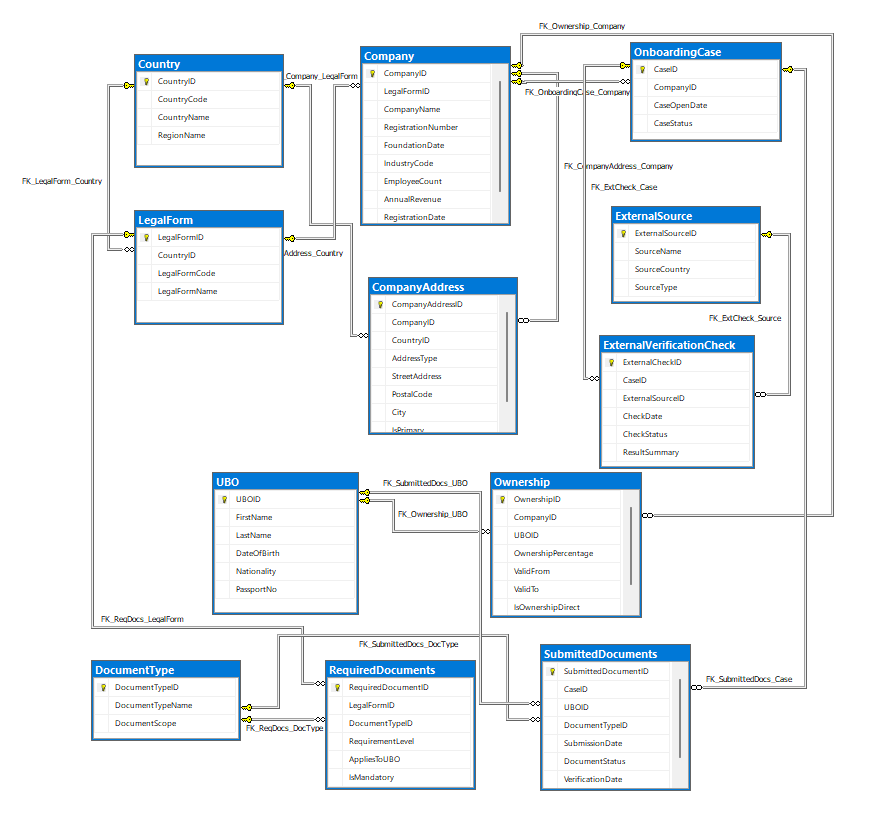

# KYC & Compliance Data Management System

> Relational database modeling AML (Anti-Money Laundering) compliance workflows and KYC onboarding processes for regulated business onboarding workflows. Implements EU Anti-Money Laundering Directive requirements including beneficial ownership identification, jurisdiction-specific document management, and automated workflow enforcement. Designed as a database-first compliance system emphasizing data integrity, auditability, and workflow enforcement at the persistence layer.

📄 Detailed architecture and design rationale available in [System_Design.md](System_Design.md)

## Contents

- [Key Features](#key-features)
- [Business Context](#business-context)
- [Architectural Considerations](#architectural-considerations)
- [Domain Logic & Workflow Automation](#domain-logic--workflow-automation)
- [Analytical Views](#analytical-views)
- [Access Control](#access-control)
- [Repository Structure](#repository-structure)
- [Additional Documentation](#additional-documentation)

---

##  Key Features

- Fully normalized relational schema (3NF) with clear domain boundaries
- Automated AML/KYC compliance workflows enforced at the database layer
- Configuration-driven document requirement management across jurisdictions
- Beneficial ownership (UBO) reporting logic per EU AMLD threshold (≥ 25%)
- Role-based access control (RBAC) following principle of least privilege
- Temporal ownership modeling supporting historical ownership tracking
- Trigger-based audit trail and transactional side-effect automation
- SQL Server native backup and recovery support

> ⚠️ All sample data used in this project is synthetic and created exclusively for demonstration purposes.

---

##  Business Context

Regulated companies must verify the identity and ownership structure of business clients before onboarding — a process mandated by the **EU Anti-Money Laundering Directive (AMLD)**. Failure to comply carries significant legal and financial risk.

This system models that end-to-end compliance workflow for companies in the **energy sector** across the **DACH and BENELUX** regions, covering:

- Legal entity classification by jurisdiction and legal form
- **UBO identification** — individuals owning ≥ 25% must be reported under AMLD
- Document completeness enforcement per legal form and country
- Full case lifecycle: `Open → InReview → Approved / Rejected → Closed`
- External verification source management (Commercial Registry, Credit Bureau, etc.)

---

##  Architectural Considerations

The architecture follows a domain-oriented relational design separating operational onboarding workflows, ownership modeling, and compliance document management into distinct bounded contexts.

The schema is organized into four bounded domains:

| Domain | Tables | Responsibility |
|--------|--------|---------------|
| Master Data | `Country`, `LegalForm`, `Company`, `CompanyAddress` | Entity registration and jurisdictional classification |
| Ownership | `UBO`, `Ownership` | Beneficial ownership graph with temporal validity |
| Documents | `DocumentType`, `RequiredDocuments`, `SubmittedDocuments` | Configuration-driven compliance document lifecycle |
| Onboarding | `OnboardingCase`, `ExternalSource`, `ExternalVerificationCheck` | Workflow orchestration and external audit trail |

**Key design decisions:**

- **Ownership as a temporal association** — `Ownership` is modeled as a many-to-many bridge with `ValidFrom`/`ValidTo` to support historical ownership tracking and point-in-time compliance queries
- **Configuration-driven document requirements** — requirements are normalized into a dedicated configuration layer (`RequiredDocuments`) to support jurisdiction-specific compliance rules without schema changes
- **Workflow enforcement at the database layer** — status transitions are validated inside stored procedures, guaranteeing process consistency independent of client applications
- **Trigger-based automation used selectively** — triggers handle transactional side effects (document status propagation, audit entry creation) rather than core business logic, keeping concerns separated
- **`PassportNo` uniqueness constraint** — enforced at the schema level to prevent duplicate UBO registration across cases
- **`IsOwnershipDirect` (BIT)** — explicitly models direct vs. indirect ownership chains, relevant for layered corporate structures

---

##  Operational Considerations

- Referential integrity enforced through 14 foreign key constraints
- Nonclustered indexing applied to high-cardinality query attributes (`CompanyName`, `LastName`, `CaseStatus`)
- Workflow-critical operations encapsulated in stored procedures — business validation centralized at the database layer
- Role-based security separation: `OnboardingReaderRole` (SELECT) vs. `OnboardingWriterRole` (SELECT + INSERT + UPDATE + EXECUTE)
- Backup and recovery implemented using SQL Server native `BACKUP DATABASE`
- Schema supports extension: new countries, legal forms, and document types can be added without structural changes

---

##  Domain Logic & Workflow Automation

### Stored Procedures

| Procedure | Description |
|-----------|-------------|
| `usp_SubmitDocument` | Full validation pipeline: case status, document type existence, duplicate detection, UBO eligibility (≥ 25%), auto-transition to InReview on completion. Returns error details via OUTPUT parameter. |
| `usp_UpdateCaseStatus` | Enforces valid lifecycle transitions with business rule validation and OUTPUT error messaging |

### Scalar Functions

| Function | Description |
|----------|-------------|
| `fn_IsUBOReportable(pct)` | Encapsulates EU AMLD 25% ownership threshold — reused across procedures and views |
| `fn_GetCaseStatusLabel(status)` | Translates internal status codes to human-readable labels for error reporting |
| `fn_CountMissingMandatoryDocs(caseID)` | Queries the configuration layer to identify outstanding compliance documents |

### Table-Valued Function

| Function | Description |
|----------|-------------|
| `fn_GetUBOsByCompany(companyID)` | Returns active beneficial owners with ownership metadata and AML reportability flag |

### Trigger

**`trg_OnboardingCase_StatusChange`** (AFTER UPDATE on `OnboardingCase`)
- On `Approved`: propagates `Verified` status to all pending documents
- On `Rejected`: propagates `Rejected` status to all pending documents
- Generates audit entry in `ExternalVerificationCheck` if not already present
- Uses `inserted`/`deleted` pseudo-tables to fire only on actual status change

### Cursor

**`cursor_cases`** in `12_Cursor.sql` — batch-oriented compliance review workflow
- Iterates all `Open`/`InReview` cases
- Calculates document gap per case using `fn_CountMissingMandatoryDocs`
- Generates per-case remediation recommendations
- Auto-transitions cases to `InReview` when document requirements are met

---

##  Analytical Views

| View | Join Strategy | Purpose |
|------|--------------|---------|
| `vw_OnboardingOverview` | INNER JOIN (4 tables) | Operational case monitoring with full company and jurisdiction context |
| `vw_DocumentCompletionStats` | GROUP BY + COUNT + HAVING | Document completion rate per case — excludes cases with no submissions |
| `vw_CompanyWithUBO` | LEFT OUTER JOIN | Full beneficial ownership picture including companies with no registered UBOs — AML reportability flag included |

---

##  Access Control

| Role | Permissions | Intended User |
|------|-------------|---------------|
| `OnboardingReaderRole` | SELECT on schema | Analysts, BI tools, reporting |
| `OnboardingWriterRole` | SELECT, INSERT, UPDATE, EXECUTE | Compliance officers, onboarding managers |

Users `OnboardingReader` and `OnboardingWriter` are assigned to their respective roles.

---

##  Tech Stack

| Component | Technology |
|-----------|-----------|
| Database | Microsoft SQL Server 2022 |
| Language | T-SQL (Transact-SQL) |
| IDE | SQL Server Management Studio (SSMS) |
| Domain | KYC / AML Compliance / Financial Services |

---

##  Sample Dataset

Synthetic data covering 6 European jurisdictions (DACH + BENELUX):

| Entity | Count | Details |
|--------|-------|---------|
| Countries | 6 | DE, AT, CH, NL, BE, LU |
| Legal Forms | 13 | GmbH, AG, UG, BV, NV, SRL, SA, SARL |
| Companies | 12 | 2 per country, energy sector (NACE 3511) |
| Addresses | 24 | Registered + Physical per company |
| UBOs | 10 | Synthetic identities with unique passport numbers |
| Ownership records | 15 | Direct and indirect ownership chains |
| Onboarding cases | 12 | Mixed statuses across full lifecycle |

---

## Repository Structure

```
📁 kyc-compliance-onboarding-db
│
├── 01_CreateDatabase.sql         # Database creation
├── 02_Tables.sql                 # 12 tables with constraints
├── 03_Indexes_Constraints.sql    # 8 NONCLUSTERED indexes + CHECK constraints
├── 04_Relationships.sql          # 14 foreign key relationships
├── 05_Views.sql                  # 3 analytical views
├── 06_Functions.sql              # 3 scalar functions + 1 table-valued function
├── 07_StoredProcedures.sql       # 2 stored procedures with OUTPUT parameters
├── 08_Triggers.sql               # AFTER UPDATE automation trigger
├── 09_TestData.sql               # Synthetic compliance dataset (all 12 tables)
├── 10_Backup.sql                 # BACKUP DATABASE script
├── 11_Users_Permissions.sql      # RBAC: 2 roles, 2 logins, 2 users, grants
├── 12_Cursor.sql                 # Batch compliance review cursor (cursor_cases)
│
├── full_script.sql               # Complete script: schema + data + cursor + backup
├── full_script_ssms.sql          # SSMS-generated schema script (schema only, UTF-16)
│
├── README.md
├── Architecture_Notes.md         # Design decisions and trade-offs
├── .gitignore
├── LICENSE
│
└── 📁 Documentation
      ├── ERD_Diagramm.png         # Entity-Relationship Diagram
      └── Projektbeschreibung.pdf  # Full project documentation (DE)
```

---

## Getting Started

**Requirements:** Microsoft SQL Server 2019+ and SQL Server Management Studio

```sql
-- Option 1: Run scripts sequentially
-- 01 → 02 → 03 → 04 → 05 → 06 → 07 → 08 → 09 → 10 → 11 → 12

-- Option 2: Deploy complete script (includes data)
-- full_script.sql

-- Option 3: Schema only (SSMS-generated)
-- full_script_ssms.sql
```

---

## Additional Documentation

Detailed architecture decisions, trade-offs, and workflow design rationale are documented separately:

- [System Design Document](System_Design.md)
- [Architecture Notes](Architecture_Notes.md)

---

## ERD Diagram



---

## Engineering & Compliance Design Highlights

- Designed relational data models for regulated financial onboarding systems (3NF, referential integrity, auditability)
- Implemented AML/KYC compliance logic aligned with EU AMLD requirements (including UBO ≥ 25% threshold enforcement)
- Engineered transactional workflows using T-SQL stored procedures, triggers, and validation constraints
- Modeled temporal ownership structures enabling historical UBO tracking and point-in-time compliance analysis
- Designed RBAC-based security model for regulated onboarding environments
- Built analytical SQL layers for compliance reporting and operational monitoring


##  Potential Extensions

The current architecture is designed to support future extension in several areas:

- Risk-based AML scoring and onboarding prioritization
- Integration with sanctions and PEP screening providers
- Event-driven workflow orchestration
- External API integration for onboarding platforms
- Immutable audit logging for regulatory traceability